# JVM Memory Model

---

## 1. Stack (per thread)

Stores method execution data:

- Local variables
- Reference variables
- Method parameters
- Stack frames
- Return information / address
- Operand stack (intermediate calculation results)

**Common error:** `StackOverflowError`
> Typically caused by deep or infinite recursion.

---

## 2. Metaspace (Method Area)

Stores:

- Class metadata
- Method metadata
- Runtime constant pool
- Static variables
- Method bytecode
- JIT-related metadata

**Common error:** `OutOfMemoryError: Metaspace`

**Configuration:**
```
-XX:MaxMetaspaceSize=512m
```

---

## 3. Heap (shared across threads)

Stores:

- Objects
- Arrays
- Instance variables (as part of objects)
- String pool / interned strings

**Common error:** `OutOfMemoryError: Java heap space`

**Heap size configuration:**

| Flag   | Description          | Example    |
|--------|----------------------|------------|
| `-Xms` | Initial heap size    | `-Xms4g`   |
| `-Xmx` | Maximum heap size    | `-Xmx8g`   |

```bash
java -Xms4g -Xmx8g MyApp
```

---

## 4. Program Counter (per thread)

Stores:

- Address of the current JVM instruction being executed

---

## JVM Memory — High-Level Layout

```
┌───────────────────────────────────────────────┐
│ Stack (per thread)                            │
│ - Local variables                             │
│ - References                                  │
│ - Method parameters                           │
│ - Stack frames                                │
└───────────────────────────────────────────────┘

┌───────────────────────────────────────────────┐
│ Metaspace                                     │
│ - Class metadata                              │
│ - Method metadata                             │
│ - Static variables                            │
│ - Runtime constant pool                       │
└───────────────────────────────────────────────┘

┌───────────────────────────────────────────────┐
│ Heap (shared)                                 │
│                                               │
│  Young Generation                             │
│  ┌─────┬─────┬─────┐                          │
│  │Eden │ S0  │ S1  │                          │
│  └─────┴─────┴─────┘                          │
│                                               │
│  Old Generation                               │
│  ┌─────────────────────┐                      │
│  │ Long-lived Objects  │                      │
│  └─────────────────────┘                      │
│                                               │
│  String Pool                                  │
└───────────────────────────────────────────────┘

┌───────────────────────────────────────────────┐
│ Program Counter (per thread)                  │
│ - Current instruction address                 │
└───────────────────────────────────────────────┘
```

---

## Heap Memory In Depth

```
┌─────────────────────────────────────────────────────────────────────────────┐
│                                JAVA HEAP                                    │
├───────────────────────────────┬─────────────────────────────────────────────┤
│       YOUNG GENERATION        │              OLD GENERATION                 │
├─────────────┬───────┬─────────┼─────────────────────────────────────────────┤
│    Eden     │  S0   │   S1    │                                             │
│             │       │         │                                             │
│ New objects │       │         │  Long-lived objects promoted from Young Gen │
│ are created │       │         │                                             │
└─────────────┴───────┴─────────┴─────────────────────────────────────────────┘
```

> `S0 + S1` = Survivor Spaces

- **Young Generation** → Minor GC — more frequent, fast
- **Old Generation** → Major GC — less frequent, slow

### Promotion from Young → Old Gen

Objects are promoted when any of the following occur:

1. Survivor space overflow
2. Dynamic age determination (object age exceeds threshold)
3. Large object allocation (goes directly to Old Gen)

---

## Java Memory Model — Worked Example

```java
class Student {
    String name;
    int age;
    static String college = "IIT G";

    public Student(String name, int age) {
        this.name = name;
        this.age = age;
    }

    // Instance method
    public void markAttendance() {
        System.out.println(name + " is present");
    }

    // Static method
    public static void changeCollege(String newCollege) {
        college = newCollege;
    }
}

public class Main {
    public static void main(String[] args) {
        Student s1 = new Student("Aditya", 28);
        s1.markAttendance();
        Student.changeCollege("IIT Bombay");
    }
}
```

### Step-by-step JVM execution

**Step 1 — JVM starts, loads `Main` class into Metaspace:**

```
┌──────────────────────────────────┐    ┌───────┐
│ Metaspace                        │    │  PC   │
│  Class: Main                     │    └───────┘
│  - main(String[] args)           │
│  - bytecode                      │
└──────────────────────────────────┘
```

**Step 2 — JVM creates main thread, pushes `main()` frame onto Stack:**

```
┌──────────────────────┐
│ Stack                │
│  main() frame        │
│  - args              │
│  - s1 = ?            │
└──────────────────────┘
```

**Step 3 — `new Student()` encountered → `Student` class loaded into Metaspace, object created in Heap:**

```
┌──────────────────────────────────────────────────────────────────────┐
│                              JVM MEMORY                              │
├──────────────────────────────────┬───────────────────────────────────┤
│  STACK  (per thread)             │  PROGRAM COUNTER  (per thread)    │
│  ┌──────────────────────────┐    │  ┌──────────────────────────┐     │
│  │  markAttendance() frame  │    │  │  current instruction ptr │     │
│  │  - this  (ref)           │    │  └──────────────────────────┘     │
│  │  - return address        │    │                                   │
│  ├──────────────────────────┤    │  StackOverflowError               │
│  │  main() frame            │    │  → deep / infinite recursion      │
│  │  - args                  │    │                                   │
│  │  - s1 ───────────────────┼────┼───────────────────────────┐       │
│  └──────────────────────────┘    │                           │       │
├──────────────────────────────────┴───────────────────────────┼───────┤
│  METASPACE                                                   │       │
│  ┌──────────────────────┐  ┌───────────────────────────────┐ │       │
│  │  Class: Main         │  │  Class: Student               │ │       │
│  │  - main(String[])    │  │  - name, age (fields)         │ │       │
│  │  - bytecode          │  │  - college = "IIT G" (static) │ │       │
│  │  - static fields     │  │  - markAttendance()           │ │       │
│  │                      │  │  - changeCollege()            │ │       │
│  └──────────────────────┘  └───────────────────────────────┘ │       │
│                             OutOfMemoryError: Metaspace       │       │
├───────────────────────────────────────────────────────────────┼───────┤
│  HEAP  (shared across threads)                                │       │
│  ┌─────────────────────────────────────────────────┐          │       │
│  │  YOUNG GENERATION  (minor GC — frequent, fast)  │          │       │
│  │  ┌─────────────────┐  ┌──────────┐  ┌────────┐  │          │       │
│  │  │      EDEN       │  │    S0    │  │   S1   │  │          │       │
│  │  │  ┌───────────┐◄─┼──┼──────────┼──┼────────┼──┼──────────┘       │
│  │  │  │ Student   │  │  │ Survivor │  │Survivor│  │                   │
│  │  │  │   (s1)    │  │  │  space   │  │ space  │  │                   │
│  │  │  │ name ─────┼──┼──┼──────────┼──┼────────┼──┼──► String Pool    │
│  │  │  │ age = 28  │  │  │          │  │        │  │                   │
│  │  │  └───────────┘  │  └──────────┘  └────────┘  │                   │
│  │  └─────────────────┘                             │                   │
│  └─────────────────────────────────────────────────┘                   │
│                         │ promote (survivor overflow / age)             │
│                         ▼                                               │
│  ┌──────────────────────────────────────────────────┐                  │
│  │  OLD GENERATION  (major GC — infrequent, slow)   │                  │
│  │          long-lived objects                      │                  │
│  └──────────────────────────────────────────────────┘                  │
│                                                                         │
│  ┌──────────────────────────────────────────────────┐                  │
│  │  STRING POOL  (heap since Java 7)                │                  │
│  │  "IIT G"   "Aditya"   "IIT Bombay"               │                  │
│  └──────────────────────────────────────────────────┘                  │
│                                                                         │
│  OutOfMemoryError: Java heap space     -Xms4g   -Xmx8g                 │
└─────────────────────────────────────────────────────────────────────────┘
```

---

## Types of References

| Type | Syntax | GC Behaviour | Use Case |
|------|--------|-------------|----------|
| **Strong** | `Student s1 = new Student()` | Never collected while referenced | Default / general use |
| **Soft** | `SoftReference<Student> s2 = new SoftReference<>(...)` | Collected only when JVM needs memory | Caching |
| **Weak** | `WeakReference<Student> s2 = new WeakReference<>(...)` | Collected on next GC cycle | `WeakHashMap`, optional caches |
| **Phantom** | `PhantomReference<Student> s2 = ...` | `get()` always returns `null` | Used internally by GC for finalization |

---

## Garbage Collection Algorithms

### 1. Mark & Sweep (Basic — Major GC)

Most common, most basic algorithm. Runs in Old Generation. Expensive operation.

**Steps:**
1. Traverse all objects and **mark** reachable ones.
2. **Sweep** (remove) unreachable objects.

**Disadvantage:** Leaves fragmented memory.

```
Before GC
─────────────────────────────────
  ✓      ✗      ✓      ✗      ✓
 [A]    [B]    [C]    [D]    [E]

After Mark & Sweep
─────────────────────────────────
 [A]    [ ]    [C]    [ ]    [E]
         ↑             ↑
     Freed Space   Freed Space
```

---

### 2. Mark & Compact (Major GC)

No fragmentation, but moving objects is costly.

```
MARK & COMPACT (Major GC)
════════════════════════════════════════════════

Before GC
─────────────────────────────────
  ✓      ✗      ✓      ✗      ✓
 [A]    [B]    [C]    [D]    [E]

Mark Phase
─────────────────────────────────
  Live Objects : A, C, E
  Garbage      : B, D

Compact Phase  →  move live objects together
─────────────────────────────────
 [A]    [C]    [E]    [     FREE SPACE     ]
```

---

### 3. Copying (Minor GC — Young Generation)

```
YOUNG GENERATION
─────────────────────────────────────────────────
┌──────────────┬────────────┬────────────┐
│    Eden      │     S0     │     S1     │
├──────────────┼────────────┼────────────┤
│  A  B  C  D  │            │            │
└──────────────┴────────────┴────────────┘

Minor GC  →  A, C survive  |  B, D are garbage
Copy A, C → S0

┌──────────────┬────────────┬────────────┐
│    Eden      │     S0     │     S1     │
├──────────────┼────────────┼────────────┤
│   (empty)    │   A    C   │            │
└──────────────┴────────────┴────────────┘
```

> ⚠️ **Stop-The-World (STW):** All GC algorithms pause application threads during collection.

---

## GC Generations Summary

| Generation | GC Type | Frequency | Speed |
|---|---|---|---|
| Young (Eden + S0 + S1) | Minor GC | Frequent | Fast |
| Old | Major GC | Infrequent | Slow |

---

## GC Evolution & Utilities

| Era | GC Type |
|---|---|
| Old Java | Sequential GC (single-threaded) |
| Modern Java | Parallel GC (multi-threaded) |

**Diagnostics:**

```bash
# Force GC (hint only — not guaranteed)
System.gc();

# On OutOfMemoryError — capture a heap dump for analysis
# Use VisualVM or Eclipse MAT to inspect
```