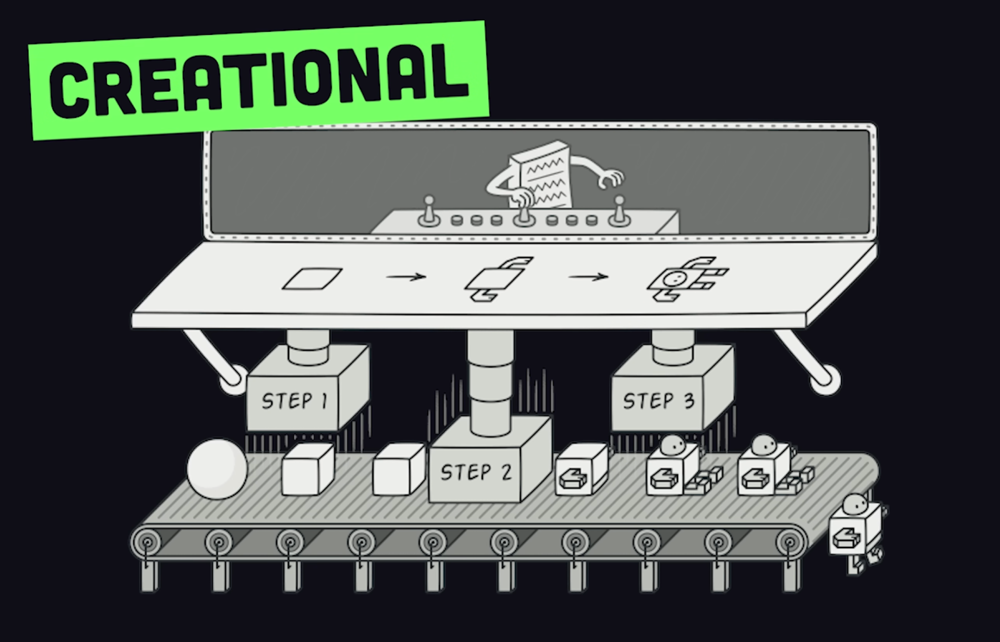
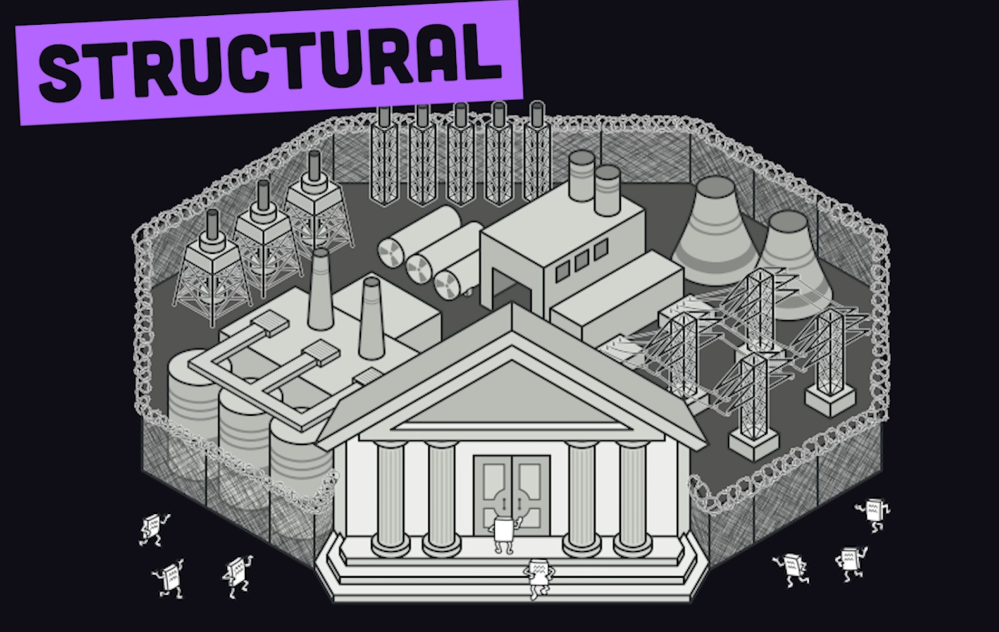
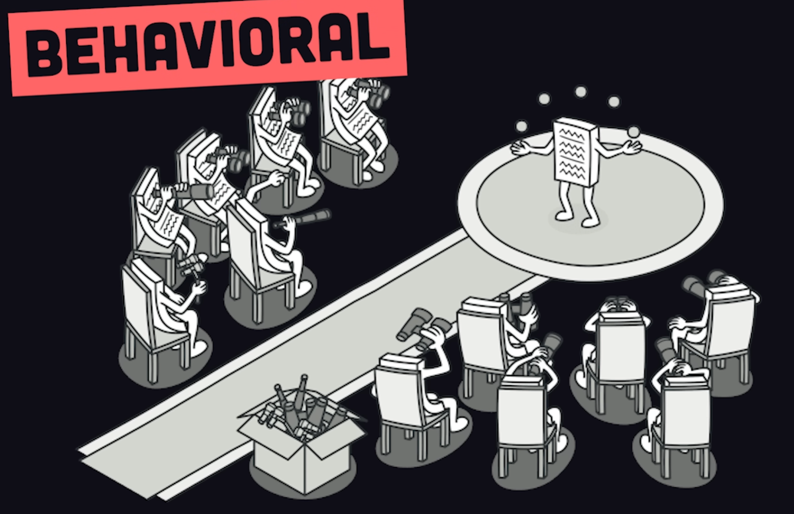

# Design Patterns

> Typical solutions to common problems in software design.

Source: [refactoring.guru/design-patterns](https://refactoring.guru/design-patterns)

---

## Creational Patterns

> How objects are created



---

### 1. Singleton

> Object that can be instantiated only once

> Violates the Single Responsibility Principle — the pattern solves two problems at once.


```java
class Singleton {

    // volatile → prevents thread issues (visibility + ordering)
    private static volatile Singleton instance;

    private Singleton() {
    }

    public static Singleton getInstance() {

        // First check (no lock) → fast path
        if (instance == null) {

            synchronized (Singleton.class) {

                // Second check (inside lock) → safety
                if (instance == null) {
                    instance = new Singleton();
                }
            }
        }

        return instance;
    }
}
```

```java
enum Singleton2 {
    INSTANCE;
}
```

Check running class here: [Singleton.java](creational/singleton/Singleton.java)

**Real world usage**

1. Logging System
2. Database Connection
3. Configuration Manager

**Where not to use**

1. Games (where multiple independent instances are needed)

---

### 2. Prototype

> **Also known as:** Clone


**Step 1: Create Prototype Class**

```java
class Car implements Cloneable {

    String model;
    int price;

    Car(String model, int price) {
        this.model = model;
        this.price = price;
    }

    @Override
    protected Object clone() throws CloneNotSupportedException {
        return super.clone();
    }

    void display() {
        System.out.println(model + " : " + price);
    }
}
```

**Step 2: Use Cloning**

```java
public class Main {

    public static void main(String[] args)
            throws CloneNotSupportedException {

        Car car1 = new Car("Tesla", 50000);

        Car car2 = (Car) car1.clone();

        car2.model = "BMW";

        car1.display();
        car2.display();
    }
}
```

---

### 3. Builder

> Objects are created step-by-step using method chaining rather than constructors.


```java
class Student {

    // final → object is immutable after creation
    private final String name;
    private final int age;

    // Private constructor → prevents direct object creation
    private Student(Builder builder) {
        this.name = builder.name;
        this.age = builder.age;
    }

    // Static inner Builder class
    public static class Builder {

        private String name;
        private int age;

        // method chaining → returns same Builder object
        public Builder Name(String name) {
            this.name = name;
            return this;
        }

        public Builder Age(int age) {
            this.age = age;
            return this;
        }

        // final step → builds the actual object
        public Student build() {
            return new Student(this);
        }
    }

    @Override
    public String toString() {
        return "Student [name=" + name + ", age=" + age + "]";
    }
}
```

```java
class Main {
    public static void main(String[] args) {

        // Creating object step-by-step using Builder
        Student student = new Student.Builder()
                .Name("Alex")
                .Age(23)
                .build();

        System.out.println(student);
    }
}
```

Check running class here: [Builder.java](creational/builder/Builder.java)

---

### 4. Factory

#### 4.1. Simple Factory

```java
package com.utkarsh.interviewprep.designpatterns.creational.factory;

public class Factory {
    public static void main(String[] args) {
        Vehicle v1 = VehicleFactory.getVehicle("car");
        v1.drive();

        Vehicle v2 = VehicleFactory.getVehicle("bike");
        v2.drive();
    }
}

interface Vehicle {
    void drive();
}

class Car implements Vehicle {
    public void drive() {
        System.out.println("Driving Car");
    }
}

class Bike implements Vehicle {
    public void drive() {
        System.out.println("Riding Bike");
    }
}

class VehicleFactory {

    // Factory method → returns object based on input
    public static Vehicle getVehicle(String type) {

        if (type.equalsIgnoreCase("car")) {
            return new Car();
        } else if (type.equalsIgnoreCase("bike")) {
            return new Bike();
        }

        return null;
    }
}
```

Check running class here: [Factory.java](creational/factory/Factory.java)

#### 4.2. Factory Method

> **Also known as:** Virtual Constructor

> Instead of using the _**new**_ keyword, we can instantiate an object using a function or method.


---

#### 4.3. Abstract Factory

> Abstract Factory is a creational design pattern that lets you produce families of related objects without specifying
> their concrete classes.


---

## Structural Patterns

> How objects relate to each other



---

### 1. Decorator

> Add new functionality to an object dynamically without altering its structure.


```
             +-----------------------------+
             |       <<interface>>         |
             |           Coffee            |
             +-----------------------------+
             | + getDescription() : String |
             | + cost() : double           |<---
             +-----------------------------+   |
                    ^             ^            |
                    |             |            |
               [is-a]          [is-a]       has-a
              (implements)   (implements)      |
                    |             |            |
     +--------------+    +----------------------------+
     | SimpleCoffee |    |     CoffeeDecorator        |  <--- abstract
     +--------------+    +----------------------------+
     | + getDesc()  |    | # coffee : Coffee  [has-a] |----> Coffee
     | + cost()     |    +----------------------------+
     +--------------+    | + CoffeeDecorator(Coffee)  |
                         | + getDescription() : String|
                         | + cost() : double          |
                         +----------------------------+
                                     ^
                                     |
                                  [is-a]
                                (extends)
                       +-------------+-------------+
                       |                           |
          +----------------------+   +----------------------+
          |    MilkDecorator     |   |   SugarDecorator     |
          +----------------------+   +----------------------+
          |  [is-a] Coffee       |   |  [is-a] Coffee       |
          |  [is-a] CoffeeDecorator  |  [is-a] CoffeeDecorator
          +----------------------+   +----------------------+
          | + getDescription()   |   | + getDescription()   |
          |   +", Milk"          |   |   +", Sugar"         |
          | + cost() +1.5        |   | + cost() +0.5        |
          +----------------------+   +----------------------+


  Relationship summary:
  +-----------------------+------------------+---------------------------+
  | From                  | To               | Relationship              |
  +-----------------------+------------------+---------------------------+
  | SimpleCoffee          | Coffee           | is-a  (implements)        |
  | CoffeeDecorator       | Coffee           | is-a  (implements)        |
  | CoffeeDecorator       | Coffee           | has-a (field: # coffee)   |
  | MilkDecorator         | CoffeeDecorator  | is-a  (extends)           |
  | MilkDecorator         | Coffee           | is-a  (indirect, via ext) |
  | SugarDecorator        | CoffeeDecorator  | is-a  (extends)           |
  | SugarDecorator        | Coffee           | is-a  (indirect, via ext) |
  +-----------------------+------------------+---------------------------+


  Runtime wrapping (main method):

  Coffee c = new SimpleCoffee();          cost = 5.0
        c = new MilkDecorator(c);         cost = 5.0 + 1.5 = 6.5
        c = new SugarDecorator(c);        cost = 6.5 + 0.5 = 7.0

  c.getDescription()  -->  "Simple Coffee, Milk, Sugar"
  c.cost()            -->  7.0

  Call chain:
  SugarDecorator.cost()
    └─> MilkDecorator.cost()
          └─> SimpleCoffee.cost()  --> 5.0
```

[DecoratorPatternDemo.java](structural/decorator/DecoratorPatternDemo.java)

---

### 2. Proxy

> The Proxy Design Pattern is a structural design pattern used to provide a placeholder or surrogate object that
> controls access to another object. Instead of interacting directly with the real object, a client talks to the proxy,
> which can add extra behavior like access control, lazy initialization, logging, or caching.


#### 2.1. Virtual Proxy

> Delays object creation (lazy loading)

> Useful for heavy objects (e.g., images, large files)

#### 2.2. ProProtection Proxy

> Controls access based on permissions

> Example: role-based access

#### 2.3. Remote Proxy

> Represents objects located remotely (e.g., RPC, web services)

```
                     +----------------------------------+
                     |         <<interface>>            |
                     |              Image               |
                     +----------------------------------+
                     | + display() : void               |
                     +----------------------------------+
                              ^               ^
                              |               |
                           [is-a]          [is-a]
                        (implements)     (implements)
                              |               |
      +-----------------------------+   +-------------------+
      |         ProxyImage          |   |     RealImage     |
      +-----------------------------+   +-------------------+
      | - realImage : RealImage     |-->| - filename:String |
      | - filename : String         |   +-------------------+
      +-----------------------------+   | + RealImage(name) |
      | + ProxyImage(name)          |   | + loadFromDisk()  |
      | + display() : void          |   | + display()       |
      +-----------------------------+   +-------------------+
                   |
             lazy creation
             (if null create)
                   |
                   v
          +-------------------+
          |   RealImage obj   |
          +-------------------+


  Relationship summary:
  +----------------------+------------------+-----------------------------+
  | From                 | To               | Relationship                |
  +----------------------+------------------+-----------------------------+
  | ProxyImage           | Image            | is-a (implements)           |
  | RealImage            | Image            | is-a (implements)           |
  | ProxyImage           | RealImage        | has-a (field: realImage)    |
  +----------------------+------------------+-----------------------------+


  Runtime flow (main method):

  Image img = new ProxyImage("photo.jpg");

        img.display();
            └─ Proxy checks:
                   realImage == null ?
                        YES
                        └─ create RealImage("photo.jpg")
                        └─ loadFromDisk()
                        └─ display()

        img.display();
            └─ Proxy checks:
                   realImage == null ?
                        NO
                        └─ directly call display()


  Output:

  Loading photo.jpg
  Displaying photo.jpg
  Displaying photo.jpg
```

[Proxy.java](structural/proxy/Proxy.java)

---

## Behavioral Patterns

> How objects communicate with each other



---

### 1. Observer

> **Also known as:** Event-Subscriber, Listener

> **One-to-many**

> Observer is a behavioral design pattern that lets you define a subscription mechanism to notify multiple objects about
> any events that happen to the object they're observing.

> An alternative to this design pattern is the polling technique.

> Can break the Single Responsibility Principle.

#### Polling

Observers repeatedly ask whether the object has changed.

The alternative is **pushing** — the object notifies observers when it changes.


```
+---------------------------+                    +---------------------------+
|      <<interface>>        |                    |      <<interface>>        |
|       IObservable         |----"has a"(1..*)-->|        IObserver          |
+---------------------------+                    +---------------------------+
| + add(IObserver o)        |                    | + update()                |
| + remove(IObserver o)     |                    +---------------------------+
| + notify()                |                                 ^
+---------------------------+                                 |
             ^                                          (implements)
             |                                               |
        (implements)                                         |
             |                                               |
+---------------------------+                    +---------------------------+
|    ConcreteObservable     |<---"has a"---------|     ConcreteObserver      |
+---------------------------+                    +---------------------------+
| - vector<IObserver*>      |                    | + update() {...}          |
|     observers             |                    +---------------------------+
| + add(IObserver o) {...}  |
| + remove(IObserver o) {..}|
| + notify() {...}          |
+---------------------------+
```

[ObserverPatternDemo.java](behavioral/observer/ObserverPatternDemo.java)

---

### 2. Strategy

> The Strategy Pattern is a behavioral design pattern that lets you define a family of algorithms, encapsulate each one,
> and make them interchangeable at runtime.

> Instead of using large **if-else** or **switch** statements, you delegate behavior to separate strategy classes.

> Follows the Open-Closed Principle.


```java
package com.utkarsh.interviewprep.designpatterns.behavioral.strategy;

public class Strategy {
    public static void main(String[] args) {

        // Using Credit Card strategy
        PaymentService payment1 =
                new PaymentService(new CreditCardPayment());

        payment1.processPayment(1000);

        // Switching to UPI strategy
        PaymentService payment2 =
                new PaymentService(new UpiPayment());

        payment2.processPayment(500);
    }
}

// Step 1: Strategy Interface
interface PaymentStrategy {
    void pay(int amount);
}

// Step 2: Different Strategies
class CreditCardPayment implements PaymentStrategy {

    public void pay(int amount) {
        System.out.println("Paid using Credit Card: " + amount);
    }
}

class UpiPayment implements PaymentStrategy {

    public void pay(int amount) {
        System.out.println("Paid using UPI: " + amount);
    }
}

// Step 3: Context Class
class PaymentService {

    // strategy can change at runtime
    private final PaymentStrategy strategy;

    public PaymentService(PaymentStrategy strategy) {
        this.strategy = strategy;
    }

    public void processPayment(int amount) {
        strategy.pay(amount);
    }
}
```

Check running class here: [Strategy.java](behavioral/strategy/Strategy.java)

---

### 3. Chain of Responsibility

> **Also known as:** CoR, Chain of Command

> **Real world use case:** Logger


```
                    +--------------------------------+
                    |         <<abstract>>          |
                    |         MoneyHandler           |
                    +--------------------------------+
                    | # nextHandler : MoneyHandler   |----[has-a]--+
                    +--------------------------------+             |
                    | + setNextHandler(MoneyHandler) |<-----------+
                    | + dispense(int amount)         |  (self-ref)
                    +--------------------------------+
                               ^
                               |
                            [is-a]
                           (extends)
                               |
            +------------------+------------------+
            |                  |                  |
+-----------------+  +-------------------+  +---------------+
| ThousandHandler |  | FiveHundredHandler|  | HundredHandler|
+-----------------+  +-------------------+  +---------------+
| +dispense(int)  |  | +dispense(int)    |  | +dispense(int)|
|  notes=amt/1000 |  |  notes=amt/500    |  |  notes=amt/100|
|  rem=amt%1000   |  |  rem=amt%500      |  |  rem=amt%100  |
+-----------------+  +-------------------+  +---------------+


  Relationship summary:
  +--------------------+---------------+-------------------------------+
  | From               | To            | Relationship                  |
  +--------------------+---------------+-------------------------------+
  | MoneyHandler       | MoneyHandler  | has-a (# nextHandler, self)   |
  | ThousandHandler    | MoneyHandler  | is-a  (extends)               |
  | FiveHundredHandler | MoneyHandler  | is-a  (extends)               |
  | HundredHandler     | MoneyHandler  | is-a  (extends)               |
  +--------------------+---------------+-------------------------------+


  Runtime chain setup (main):

  h1000 --[next]--> h500 --[next]--> h100 --[next]--> null
  ThousandHandler   FiveHundredHandler   HundredHandler


  Execution trace for amount = 3700:

  h1000.dispense(3700)
    ├─ notes = 3700 / 1000 = 3  --> prints "1000 Notes: 3"
    └─ remainder = 700
         h500.dispense(700)
           ├─ notes = 700 / 500 = 1  --> prints "500 Notes: 1"
           └─ remainder = 200
                h100.dispense(200)
                  ├─ notes = 200 / 100 = 2  --> prints "100 Notes: 2"
                  └─ remainder = 0  --> done


  Output:
  Dispensing Amount: 3700
  1000 Notes: 3
  500 Notes:  1
  100 Notes:  2
```

[ChainOfResponsibilityDemo.java](behavioral/chainofresponsibility/ChainOfResponsibilityDemo.java)

----

### 4. State

>

```

```

[State.java](behavioral/state/State.java)

---